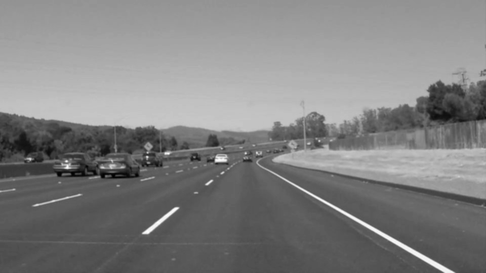
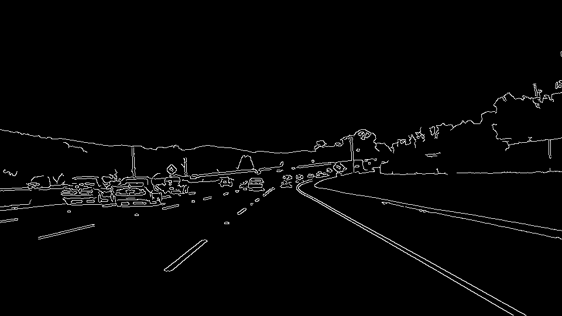
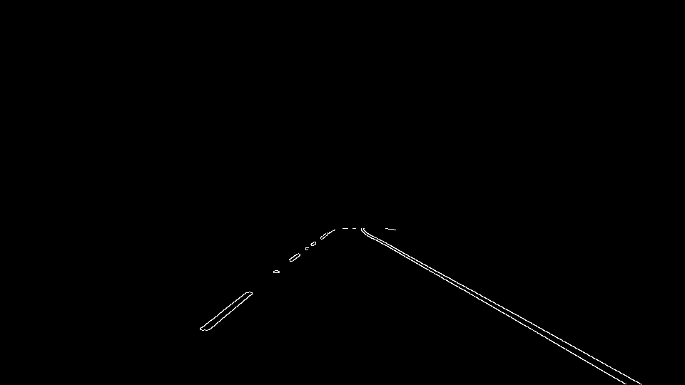
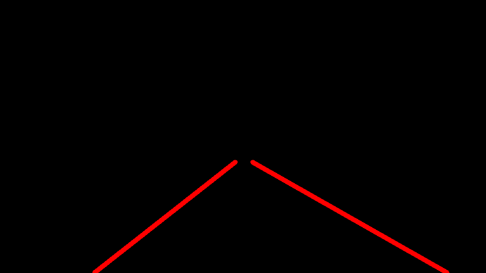
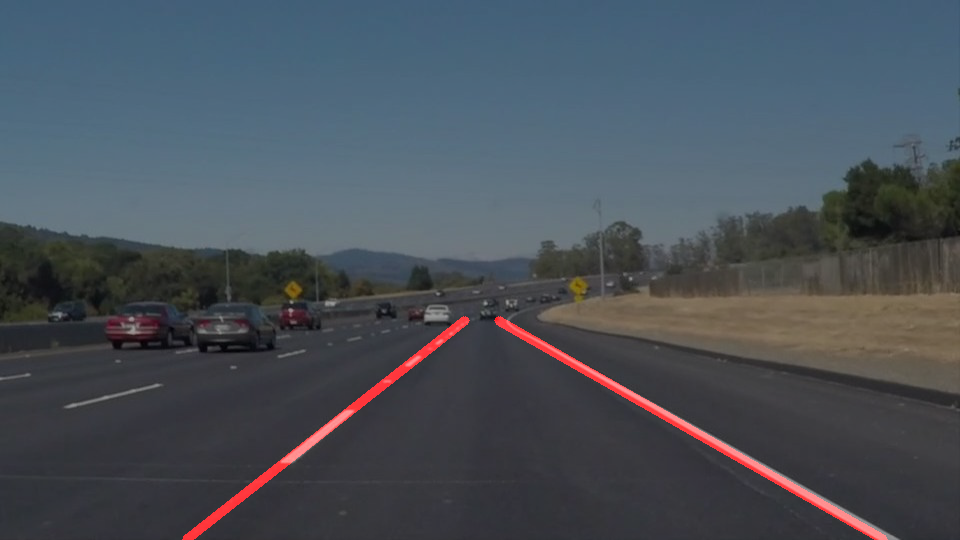

# **Finding Lane Lines on the Road** 

## Reflection

### 1. Pipeline Description

My processing pipelines consists of 8 steps as follows:

* **Read the image**

 &nbsp;&nbsp;&nbsp;&nbsp;&nbsp;&nbsp;&nbsp;&nbsp;

* **Convert it to greysacle**

 &nbsp;&nbsp;&nbsp;&nbsp;&nbsp;&nbsp;&nbsp;&nbsp;

* **Blur it using a gaussian kernel**

    The filter size was set to 3 x 3 based on trial and error tuning

 &nbsp;&nbsp;&nbsp;&nbsp;&nbsp;&nbsp;&nbsp;&nbsp;

* **Detect the edges**

    The `low_threshold` and the `high_threshold` walues were set to `50` and `150` respectively based on trial and error tuning.

 &nbsp;&nbsp;&nbsp;&nbsp;&nbsp;&nbsp;&nbsp;&nbsp;

* **Narrow down the seach area to a region of inetest**

    Based on the given images a region of interest was chosen.

 &nbsp;&nbsp;&nbsp;&nbsp;&nbsp;&nbsp;&nbsp;&nbsp;

* **Find the lines using hough transform**

    The hough parameters were tuned based on trial and error and were set to the following values:
`rho=1
, theta= math.pi/180
, threshold=25
, min_line_len=3
, max_line_gap=1`

* **Draw the lines**

    To draw the lines I needed to edit the `draw_lines` function accordingly:
    1. The slopes were calculated for all the detected lines.
    2. The line segments were grouped into one of two gropus.
    The ones which were closer to the maximum slope were grouped together in one group and the ones which were closer to the minimum slope were grouped in the other group.
    The points which were not too close to each of them were excluded based on a manually tuned `group_sensitivity` variable.
    3. Further outliers exclusion was applied by excluding the points have slopes with a distance greater than the `group_sensitivity` variable from the group median slope.
    4. Finally, for each group, a linear fit was applied to fit a line given the data points of each group of lines.

 &nbsp;&nbsp;&nbsp;&nbsp;&nbsp;&nbsp;&nbsp;&nbsp;

* **Add the lines to the original photo**

    As a last step, the lines were shown on the original image as shown

 &nbsp;&nbsp;&nbsp;&nbsp;&nbsp;&nbsp;&nbsp;&nbsp;

### 2. Method Shortcomings

The method works in a relatively nice conditions. For example this method does not work with the extra challenge given the shadow and the different settings.
The parameters were tuned and chosen in a hard trail and error way which is not versatile and not adaptive to changes.

### 3. Possible Improvements

One possible improvement is to tackle the challenges by making the algorithm more robust to lightening, shape, and shift changes by using some classical computer vision algorithms.
However a more inetersting approach is to train a machine learning model using annotated lane lines in different conditions.
 This could provide a robust model which could be applicable in different settings.